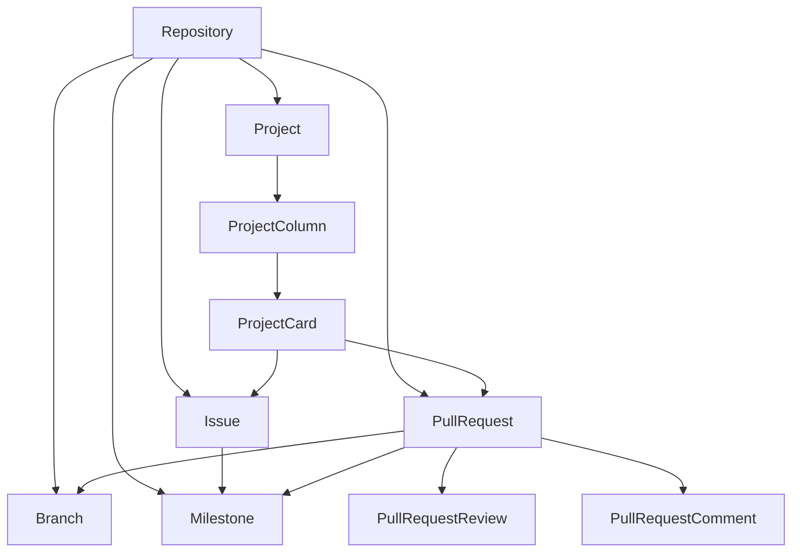

# PyGithub API Documentation

This documentation provides detailed information about the key objects in the PyGithub library and their usage.

## Core Objects

### [Repository](objects/core/Repository.md)
The central object representing a GitHub repository. Provides access to all repository-related operations and serves as the entry point for most GitHub operations.

### [Branch](objects/core/Branch.md)
Represents a Git branch in a repository. Handles branch protection rules, status checks, and branch management.

## Issue Tracking

### [Issue](objects/issues/Issue.md)
Represents a GitHub issue. Handles issue creation, comments, labels, assignees, and other issue-related operations.

### [Milestone](objects/issues/Milestone.md)
Represents a GitHub milestone. Used for grouping issues and pull requests into deliverable units.

## Project Management

### [Project](objects/projects/Project.md)
Represents a GitHub project board. Manages project columns, cards, and automation rules for task tracking.

## Code Review

### [PullRequest](objects/pulls/PullRequest.md)
Represents a GitHub pull request. Handles code review workflows, merging changes, and branch management.

## Object Relationships



## Common Workflows

### Repository Management
1. Create/fork repositories
2. Manage repository settings
3. Handle collaborators and teams
4. Configure branch protection

### Issue Tracking
1. Create and manage issues
2. Organize with labels and milestones
3. Track progress and status
4. Handle assignments

### Project Planning
1. Set up project boards
2. Create and organize columns
3. Add and move cards
4. Track project progress

### Code Review
1. Create pull requests
2. Review code changes
3. Manage review comments
4. Handle merging

## Best Practices

### Authentication
```python
from github import Github

# Using personal access token
g = Github("your-token")

# Using username and password (not recommended)
g = Github("username", "password")

# Using environment variable
import os
g = Github(os.getenv("GITHUB_TOKEN"))
```

### Error Handling
```python
from github import Github, GithubException

try:
    repo = g.get_repo("owner/repo")
    # Perform operations
except GithubException as e:
    if e.status == 404:
        print("Repository not found")
    elif e.status == 403:
        print("Permission denied")
    else:
        print(f"Error: {e.status} - {e.data}")
```

### Rate Limiting
```python
# Check rate limit status
rate_limit = g.get_rate_limit()
print(f"Remaining calls: {rate_limit.core.remaining}")
print(f"Reset time: {rate_limit.core.reset}")

# Handle rate limiting
def handle_rate_limit():
    rate_limit = g.get_rate_limit()
    if rate_limit.core.remaining == 0:
        reset_timestamp = rate_limit.core.reset.timestamp()
        sleep_time = reset_timestamp - time.time()
        if sleep_time > 0:
            time.sleep(sleep_time)
```

### Pagination
```python
# Handle large result sets
for item in repo.get_issues():  # Automatically paginated
    process_item(item)

# Manual pagination control
issues = repo.get_issues()
first_100 = issues.get_page(0)
next_100 = issues.get_page(1)
```

## Additional Resources

- [GitHub REST API Documentation](https://docs.github.com/en/rest)
- [PyGithub Repository](https://github.com/PyGithub/PyGithub)
- [GitHub GraphQL API](https://docs.github.com/en/graphql)

## Contributing

When contributing to this documentation:

1. Follow the established format
2. Include practical examples
3. Document common use cases
4. Add error handling examples
5. Keep code snippets concise
6. Update relationships diagram
7. Maintain cross-references
8. Test code examples
