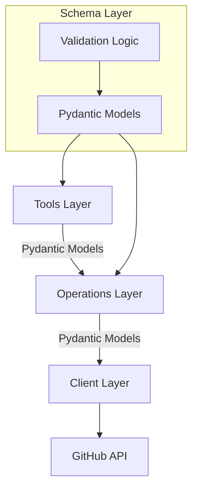

# ADR 007: Pydantic-First Architecture

## Status
Proposed

## Context
Our current architecture has three distinct layers:

1. **Tools Layer**: MCP-facing functions that accept Pydantic models for input validation, but then unpack these models into individual parameters before passing them to the operations layer.

2. **Operations Layer**: Functions that implement business logic using individual parameters rather than Pydantic models.

3. **Test Layer**: Tests that directly call operations-layer functions, bypassing the schema validation in the tools layer.

This architecture creates several issues:

- **Redundant Validation Logic**: The tools layer uses Pydantic models for validation, but the operations layer needs to implement its own validation logic.
- **Inconsistent Error Handling**: Validation errors can be raised as raw Python exceptions in operations or as GitHubError in tools.
- **Violation of DRY Principle**: We define validation logic in schemas but must duplicate checks in operations.
- **Test Fragility**: Tests that call operations directly expect GitHubError but may get different exception types.
- **Unclear Ownership of Validation**: It's not clear which layer is responsible for validation.
- **Type Safety Gaps**: Parameter unpacking loses the type safety provided by Pydantic models.

We discovered this issue specifically with datetime validation in the `list_issues` and `list_issue_comments` operations. Tests are calling these operations directly with an invalid "not_a_date" string and expecting to get a `GitHubError`, but instead receiving a raw `ValueError` from the datetime conversion function.

## Decision

We will adopt a "Pydantic-First" architecture with the following key principles:

1. **Make Pydantic models the primary data interchange format between all layers**
   - Operations layer will accept Pydantic models directly as parameters
   - No unpacking of models between layers
   - All validation logic lives exclusively in Pydantic models

2. **Standardize error handling across all layers**
   - Wrap all validation errors as GitHubError
   - Provide consistent error messages
   - Ensure tests can reliably expect GitHubError for validation issues

3. **Define clear layer responsibilities**
   - **Tools Layer**: Handle MCP protocol interactions, convert to/from JSON
   - **Operations Layer**: Execute business logic using validated Pydantic models
   - **Client Layer**: Interface with external API (PyGithub)



## Implementation Details

### 1. Operations Layer Refactoring

The operations layer functions will be refactored to accept Pydantic models directly:

```python
# src/pygithub_mcp_server/operations/issues.py

from typing import List, Dict, Any
from github import GithubException

from ..client import GitHubClient
from ..errors import GitHubError, validation_error_to_github_error
from ..schemas.issues import ListIssuesParams

@validation_error_to_github_error
def list_issues(params: ListIssuesParams) -> List[Dict[str, Any]]:
    """List issues in a repository.

    Args:
        params: Validated parameters for listing issues

    Returns:
        List of issues from GitHub API

    Raises:
        GitHubError: If the API request fails or validation fails
    """
    try:
        client = GitHubClient.get_instance()
        repository = client.get_repo(f"{params.owner}/{params.repo}")

        # Build kwargs for get_issues from params
        kwargs = {}
        
        # Default to 'open' if state is None
        kwargs["state"] = params.state or 'open'
        
        # Add optional parameters only if provided
        if params.sort:
            kwargs["sort"] = params.sort
        if params.direction:
            kwargs["direction"] = params.direction
        if params.since:
            kwargs["since"] = params.since
        if params.labels is not None:
            from ..converters.parameters import convert_labels_parameter
            kwargs["labels"] = convert_labels_parameter(params.labels)
            
        # Get paginated issues
        paginated_issues = repository.get_issues(**kwargs)
        
        # Handle pagination
        if params.page is not None and params.per_page is not None:
            # Use both page and per_page for precise pagination
            start = (params.page - 1) * params.per_page
            end = start + params.per_page
            issues = list(paginated_issues[start:end])
        elif params.page is not None:
            # Use default per_page value (30) with specified page
            issues = paginated_issues.get_page(params.page - 1)
        elif params.per_page is not None:
            # Get just the first per_page items
            issues = list(paginated_issues[:params.per_page])
        else:
            # No pagination, get all issues
            issues = list(paginated_issues)
        
        # Convert each issue to our schema
        return [convert_issue(issue) for issue in issues]
    
    except GithubException as e:
        # Convert PyGithub exception to our error type
        raise client._handle_github_exception(e)
```

### 2. Tools Layer Simplification

The tools layer will be simplified to pass models directly to operations:

```python
# src/pygithub_mcp_server/tools/issues/tools.py

@tool()
def list_issues(params: ListIssuesParams) -> dict:
    """List issues from a GitHub repository.
    
    Args:
        params: Parameters for listing issues
    
    Returns:
        List of issues from GitHub API
    """
    try:
        logger.debug(f"list_issues called with params: {params}")
        
        # Pass the validated Pydantic model directly to operations
        result = issues.list_issues(params)
        
        logger.debug(f"Got result: {result}")
        return {"content": [{"type": "text", "text": json.dumps(result, indent=2)}]}
    
    except GitHubError as e:
        logger.error(f"GitHub error: {e}")
        return {
            "content": [{"type": "error", "text": format_github_error(e)}],
            "is_error": True
        }
    except Exception as e:
        logger.error(f"Unexpected error: {e}")
        error_msg = str(e) if str(e) else "An unexpected error occurred"
        return {
            "content": [{"type": "error", "text": f"Internal server error: {error_msg}"}],
            "is_error": True
        }
```

### 3. Validation Error Handling

We'll add a decorator to convert Pydantic validation errors to GitHubError:

```python
# src/pygithub_mcp_server/errors/validation.py

import functools
from pydantic import ValidationError
from .github import GitHubError

def validation_error_to_github_error(func):
    """Decorator to convert Pydantic ValidationError to GitHubError.
    
    This ensures consistent error handling across the application.
    """
    @functools.wraps(func)
    def wrapper(*args, **kwargs):
        try:
            return func(*args, **kwargs)
        except ValidationError as e:
            # Convert Pydantic validation error to our standard GitHubError
            errors = e.errors()
            if errors:
                # Format the first error as a clear message
                field = errors[0].get('loc', ['unknown'])[0]
                message = errors[0].get('msg', 'Invalid value')
                error_msg = f"Validation error: {field} - {message}"
            else:
                error_msg = "Invalid input data"
                
            raise GitHubError(error_msg)
    return wrapper
```

### 4. Test Layer Consistency

Tests can continue to use operations directly, with consistent error behavior:

```python
# tests/integration/operations/issues/test_parameter_validation.py

def test_list_issues_invalid_since(test_owner, test_repo_name):
    """Test list_issues with invalid since parameter."""
    from pygithub_mcp_server.schemas.issues import ListIssuesParams
    
    # Create a params object with invalid 'since' value
    params = ListIssuesParams(
        owner=test_owner,
        repo=test_repo_name,
        since="not_a_date"  # Invalid date format
    )
    
    with pytest.raises(GitHubError) as exc_info:
        issues.list_issues(params)
    
    # Verify proper error message
    assert "since parameter" in str(exc_info.value).lower()
```

## Consequences

### Positive

- **Cleaner Code**: Removes redundant validation and parameter unpacking/repacking
- **Better Type Safety**: Full type checking throughout the stack
- **DRY Validation Logic**: Validation logic lives only in Pydantic models
- **Consistent Error Types**: All validation errors become GitHubError with clear messages
- **Self-Documenting Parameters**: Functions declare exactly what data structure they need
- **Easier Testing**: Tests can reliably expect GitHubError for all validation issues
- **Improved Maintainability**: Reduced duplication and clearer responsibilities
- **Enhanced Documentation**: Function signatures explicitly show expected data structures

### Negative

- **Initial Migration Effort**: Significant refactoring needed for all operations
- **Learning Curve**: Contributors need to understand the Pydantic-First approach
- **Larger Parameter Objects**: Function signatures may look more compact but have more complex params
- **Potential Performance Impact**: Additional object creation (though negligible for this use case)

## Implementation Plan

The implementation will be phased to minimize disruption:

1. **Phase 1: Foundation (Week 1)**
   - Create validation_error_to_github_error decorator
   - Update error handling utilities
   - Document new patterns

2. **Phase 2: Issues Module (Week 2)**
   - Convert issues operations to accept Pydantic models
   - Update issues tools to pass models directly
   - Update affected tests
   - Validate all functionality works as expected

3. **Phase 3: Remaining Modules (Week 3+)**
   - Gradually convert other operations modules
   - Update corresponding tools
   - Update remaining tests

4. **Phase 4: Documentation and Patterns (Ongoing)**
   - Update system_patterns.md with new patterns
   - Add examples to documentation
   - Refine based on feedback

## Alternatives Considered

1. **Keep Current Architecture**: This would require simply updating the validation in the operations layer to handle more edge cases, but would leave the architectural issues unresolved.

2. **Hybrid Approach**: Operations could accept both Pydantic models and raw parameters, but this would increase complexity and still have inconsistent validation.

3. **Custom Validation Framework**: Build a separate validation system specifically for operations, but this would duplicate Pydantic's functionality.

## References

- [Pydantic Documentation](https://docs.pydantic.dev/)
- [Type Safety in Python](https://mypy.readthedocs.io/)
- System Patterns documentation
- Previous ADRs on schema organization and validation
