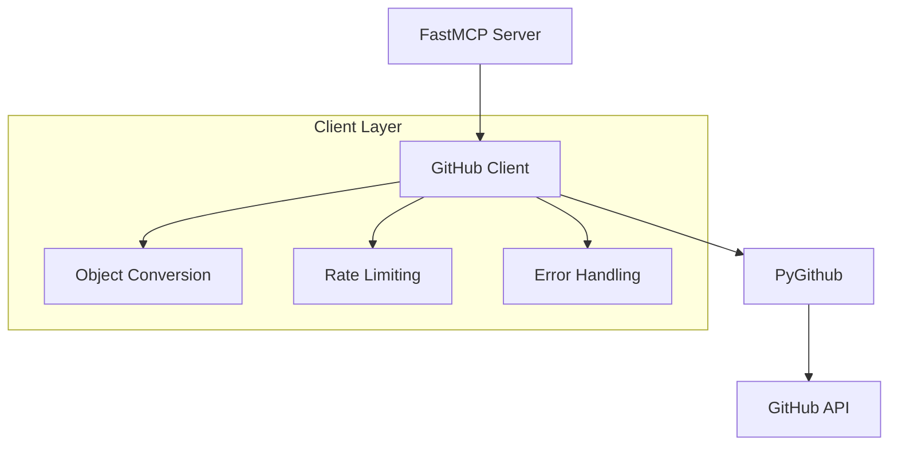
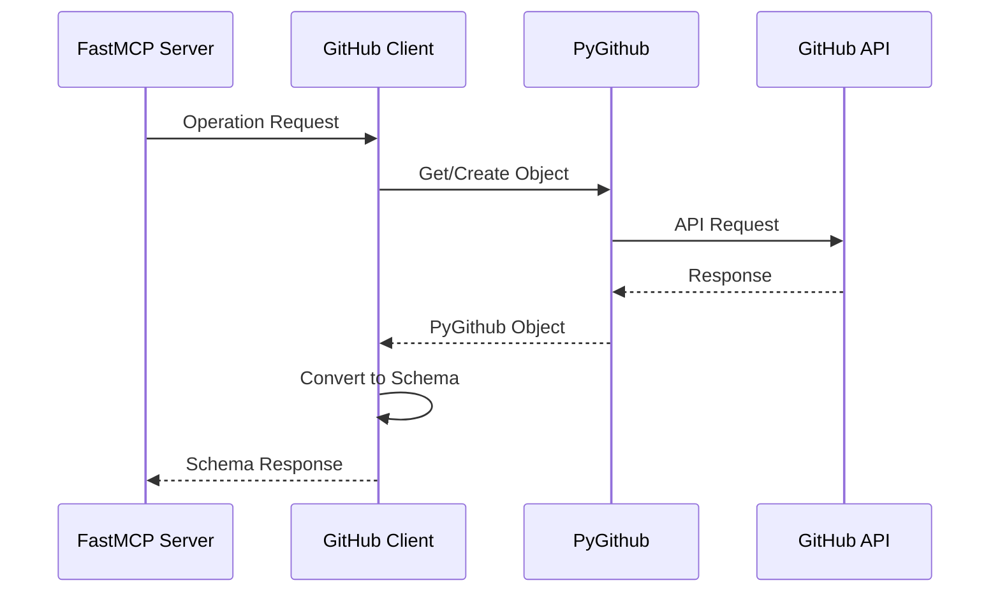
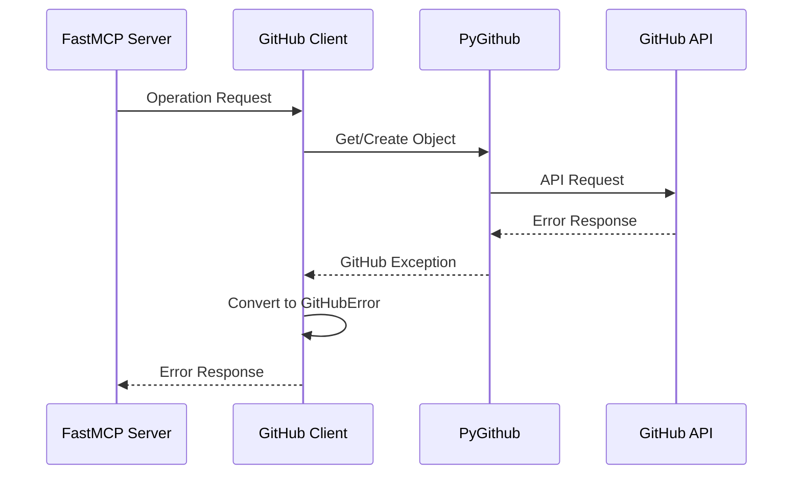

# System Patterns

## Core Architecture

### GitHub Integration


### Component Relationships

1. GitHub Client (Singleton)
   - Manages PyGithub instance
   - Handles authentication
   - Provides conversion utilities
   - Manages rate limiting
   - Centralizes error handling

2. Operation Modules
   - Use GitHub client for API interactions
   - Convert between schemas and objects
   - Maintain consistent patterns
   - Focus on specific domains
   - Handle pagination

3. Schema Layer
   - Models based on PyGithub objects
   - Pydantic validation
   - Clear type definitions
   - Documented relationships
   - Conversion utilities

### Implementation Patterns

1. Client Usage
```python
# Pattern for operations
def operation_function(params):
    client = GitHubClient.get_instance()
    # Use PyGithub objects
    # Convert to our schema
    return result
```

2. Schema Conversion
```python
# Pattern for object conversion
def convert_github_object(obj):
    return {
        "field": obj.field,
        # Map PyGithub fields to our schema
    }
```

3. Error Handling
```python
# Pattern for error handling
try:
    github_obj = client.operation()
    return convert_github_object(github_obj)
except GithubException as e:
    raise GitHubError(str(e))
```

## System Flow

### Operation Flow


### Error Flow


## Design Patterns

### 1. Singleton Pattern (GitHub Client)
```python
class GitHubClient:
    _instance = None

    @classmethod
    def get_instance(cls):
        if cls._instance is None:
            cls._instance = cls()
        return cls._instance
```

### 2. Factory Pattern (Object Conversion)
```python
class GitHubObjectFactory:
    @staticmethod
    def create_from_github_object(obj):
        if isinstance(obj, github.Issue.Issue):
            return convert_issue(obj)
        # ... other object types
```

### 3. Strategy Pattern (Error Handling)
```python
class ErrorHandler:
    def handle_error(self, error):
        if isinstance(error, RateLimitExceededException):
            return handle_rate_limit(error)
        # ... other error types
```

## Testing Patterns

### 1. Unit Testing
```python
def test_issue_conversion():
    # Given
    mock_issue = create_mock_issue()
    # When
    result = convert_github_object(mock_issue)
    # Then
    assert_valid_schema(result)
```

### 2. Integration Testing
```python
def test_list_issues_integration():
    # Given
    client = GitHubClient.get_instance()
    # When
    issues = client.list_issues(owner, repo)
    # Then
    assert_valid_response(issues)
```

### 3. Mock Testing
```python
def test_error_handling():
    # Given
    mock_github = create_mock_github_with_error()
    # When
    with pytest.raises(GitHubError):
        client.operation()
```

## Documentation Patterns

### 1. Function Documentation
```python
def operation_name(params: ParamsType) -> ResultType:
    """Operation description.
    
    Args:
        params: Parameter description
        
    Returns:
        Description of return value
        
    Raises:
        GitHubError: Error conditions
    """
```

### 2. Class Documentation
```python
class ClassName:
    """Class description.
    
    Attributes:
        attr_name: Attribute description
        
    Methods:
        method_name: Method description
    """
```

### 3. Schema Documentation
```python
class SchemaModel(BaseModel):
    """Schema description.
    
    Maps to PyGithub ObjectType.
    See: [link to PyGithub docs]
    """
