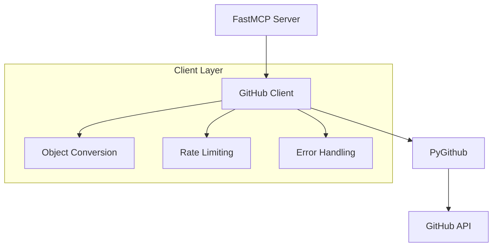
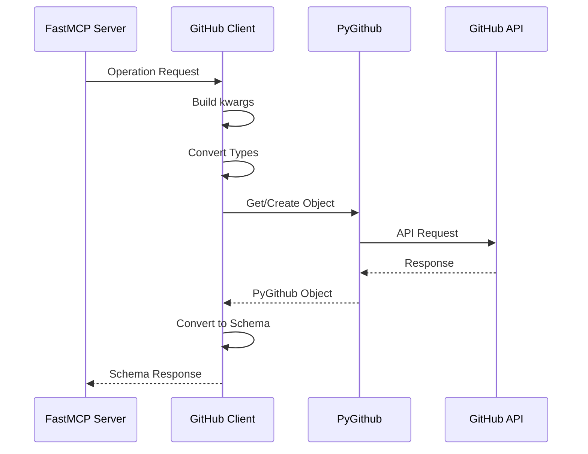
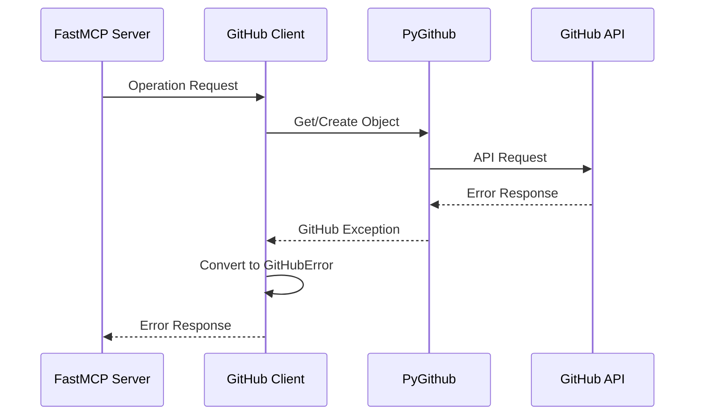

# System Patterns

## Core Architecture

### GitHub Integration


### Component Relationships

1. GitHub Client (Singleton)
   - Manages PyGithub instance
   - Handles authentication
   - Provides conversion utilities
   - Manages rate limiting
   - Centralizes error handling

2. Operation Modules
   - Use GitHub client for API interactions
   - Convert between schemas and objects
   - Maintain consistent patterns
   - Focus on specific domains
   - Handle pagination

3. Schema Layer
   - Models based on PyGithub objects
   - Pydantic validation
   - Clear type definitions
   - Documented relationships
   - Conversion utilities

### Implementation Patterns

1. Client Usage
```python
# Pattern for operations
def operation_function(params):
    client = GitHubClient.get_instance()
    # Use PyGithub objects
    # Convert to our schema
    return result
```

2. Schema Conversion
```python
# Pattern for object conversion
def convert_github_object(obj):
    return {
        "field": obj.field,
        # Map PyGithub fields to our schema
    }
```

3. Error Handling
```python
# Pattern for error handling
try:
    github_obj = client.operation()
    return convert_github_object(github_obj)
except GithubException as e:
    raise GitHubError(str(e))
```

4. Optional Parameter Handling
```python
# Pattern for handling optional parameters
def create_something(required_param, **optional_params):
    # Build kwargs with required parameters
    kwargs = {"required": required_param}
    
    # Add optional parameters only if provided
    if "milestone" in optional_params:
        try:
            kwargs["milestone"] = get_milestone_object(optional_params["milestone"])
        except Exception as e:
            raise GitHubError(f"Invalid milestone: {e}")
    
    if "labels" in optional_params and optional_params["labels"]:
        kwargs["labels"] = optional_params["labels"]
    
    # Make API call with only provided parameters
    return client.create_something(**kwargs)
```

## System Flow

### Operation Flow


### Error Flow


## Design Patterns

### 1. Singleton Pattern (GitHub Client)
```python
class GitHubClient:
    _instance = None

    @classmethod
    def get_instance(cls):
        if cls._instance is None:
            cls._instance = cls()
        return cls._instance
```

### 2. Factory Pattern (Object Conversion)
```python
class GitHubObjectFactory:
    @staticmethod
    def create_from_github_object(obj):
        if isinstance(obj, github.Issue.Issue):
            return convert_issue(obj)
        # ... other object types
```

### 3. Strategy Pattern (Error Handling)
```python
class ErrorHandler:
    def handle_error(self, error):
        if isinstance(error, RateLimitExceededException):
            return handle_rate_limit(error)
        # ... other error types
```

## Testing Patterns

### 1. Unit Testing
```python
def test_issue_conversion():
    # Given
    mock_issue = create_mock_issue()
    # When
    result = convert_github_object(mock_issue)
    # Then
    assert_valid_schema(result)
```

### 2. Integration Testing
```python
def test_list_issues_integration():
    # Given
    client = GitHubClient.get_instance()
    # When
    issues = client.list_issues(owner, repo)
    # Then
    assert_valid_response(issues)
```

### 3. Mock Testing
```python
def test_error_handling():
    # Given
    mock_github = create_mock_github_with_error()
    # When
    with pytest.raises(GitHubError):
        client.operation()
```

## Documentation Patterns

### 1. Function Documentation
```python
def operation_name(params: ParamsType) -> ResultType:
    """Operation description.
    
    Args:
        params: Parameter description
        
    Returns:
        Description of return value
        
    Raises:
        GitHubError: Error conditions
    """
```

### 2. Class Documentation
```python
class ClassName:
    """Class description.
    
    Attributes:
        attr_name: Attribute description
        
    Methods:
        method_name: Method description
    """
```

### 3. Schema Documentation
```python
class SchemaModel(BaseModel):
    """Schema description.
    
    Maps to PyGithub ObjectType.
    See: [link to PyGithub docs]
    """
```

## Validation Patterns

### 1. Field Validation
```python
class SchemaModel(BaseModel):
    model_config = ConfigDict(strict=True)
    
    title: str = Field(..., description="Title field", strict=True)
    
    @field_validator('title')
    @classmethod
    def validate_title(cls, v):
        """Validate that title is not empty."""
        if not v.strip():
            raise ValueError("title cannot be empty")
        return v
```

### 2. Datetime Validation
```python
class DateTimeModel(BaseModel):
    since: Optional[datetime] = Field(
        None, 
        description="Filter by date (ISO 8601 format with timezone: YYYY-MM-DDThh:mm:ssZ)"
    )
    
    @field_validator('since', mode='before')
    @classmethod
    def validate_since(cls, v):
        """Convert string dates to datetime objects.
        
        Accepts:
        - ISO 8601 format strings with timezone (e.g., "2020-01-01T00:00:00Z")
        - ISO 8601 format strings with timezone without colon (e.g., "2020-01-01T12:30:45-0500")
        - datetime objects
        
        Returns:
        - datetime object
        
        Raises:
        - ValueError: If the string is not a valid ISO 8601 datetime with timezone
        """
        if isinstance(v, str):
            # Check for ISO format with time component and timezone
            if not ('T' in v and ('+' in v or 'Z' in v or '-' in v.split('T')[1])):
                raise ValueError(
                    f"Invalid ISO format datetime: {v}. "
                    f"Must be in format YYYY-MM-DDThh:mm:ss+00:00 or YYYY-MM-DDThh:mm:ssZ"
                )
            
            try:
                # Handle 'Z' timezone indicator by replacing with +00:00
                v = v.replace('Z', '+00:00')
                
                # Handle timezone formats without colons (e.g., -0500 -> -05:00)
                # Check if there's a timezone part (+ or - followed by 4 digits)
                if ('+' in v or '-' in v.split('T')[1]):
                    # Find the position of the timezone sign
                    sign_pos = max(v.rfind('+'), v.rfind('-'))
                    if sign_pos > 0:
                        timezone_part = v[sign_pos:]
                        # If timezone doesn't have a colon and has 5 chars (e.g., -0500)
                        if ':' not in timezone_part and len(timezone_part) == 5:
                            # Insert colon between hours and minutes
                            v = v[:sign_pos+3] + ':' + v[sign_pos+3:]
                
                return datetime.fromisoformat(v)
            except ValueError:
                raise ValueError(
                    f"Invalid ISO format datetime: {v}. "
                    f"Contains invalid date/time components."
                )
        return v
```

### 3. Enum Validation
```python
class StateModel(BaseModel):
    state: Optional[str] = Field(
        None, 
        description=f"Issue state: {', '.join(VALID_STATES)}"
    )
    
    @field_validator('state')
    @classmethod
    def validate_state(cls, v):
        """Validate that state is one of the allowed values."""
        if v is not None and v not in VALID_STATES:
            raise ValueError(f"Invalid state: {v}. Must be one of: {', '.join(VALID_STATES)}")
        return v
```

### 4. Numeric Validation
```python
class PaginationModel(BaseModel):
    page: Optional[int] = Field(
        None, 
        description="Page number for pagination (1-based)"
    )
    per_page: Optional[int] = Field(
        None, 
        description="Results per page (max 100)"
    )
    
    @field_validator('page')
    @classmethod
    def validate_page(cls, v):
        """Validate that page is a positive integer."""
        if v is not None and v < 1:
            raise ValueError("Page number must be a positive integer")
        return v
    
    @field_validator('per_page')
    @classmethod
    def validate_per_page(cls, v):
        """Validate that per_page is a positive integer <= 100."""
        if v is not None:
            if v < 1:
                raise ValueError("Results per page must be a positive integer")
            if v > 100:
                raise ValueError("Results per page cannot exceed 100")
        return v
```

## Testing Patterns

### 1. Schema Validation Testing
```python
def test_valid_data(valid_data):
    """Test that valid data passes validation."""
    params = SchemaModel(**valid_data)
    assert params.field == valid_data["field"]

def test_invalid_field_types(valid_base_data):
    """Test that invalid field types raise validation errors."""
    with pytest.raises(ValidationError) as exc_info:
        SchemaModel(
            **valid_base_data,
            field=123  # Should be a string
        )
    assert "field" in str(exc_info.value).lower()

def test_empty_string_validation(valid_base_data):
    """Test that empty strings raise validation errors."""
    with pytest.raises(ValidationError) as exc_info:
        SchemaModel(
            **valid_base_data,
            field=""
        )
    assert "field cannot be empty" in str(exc_info.value).lower()
```

### 2. Datetime Testing
```python
def test_datetime_parsing(valid_base_data):
    """Test that datetime strings are correctly parsed."""
    # Test with various formats
    params = DateTimeModel(
        **valid_base_data,
        since="2020-01-01T00:00:00Z"
    )
    assert isinstance(params.since, datetime)
    
    # Test with negative timezone offset
    params = DateTimeModel(
        **valid_base_data,
        since="2020-01-01T12:30:45-05:00"
    )
    assert isinstance(params.since, datetime)
    
    # Test with compact negative timezone offset
    params = DateTimeModel(
        **valid_base_data,
        since="2020-01-01T12:30:45-0500"
    )
    assert isinstance(params.since, datetime)
    
    # Test with timezone format that has a colon (no normalization needed)
    params = DateTimeModel(
        **valid_base_data,
        since="2020-01-01T12:30:45+05:00"
    )
    assert isinstance(params.since, datetime)
    
    # Test with timezone format that doesn't have 5 chars (e.g., +05)
    params = DateTimeModel(
        **valid_base_data,
        since="2020-01-01T12:30:45+05"
    )
    assert isinstance(params.since, datetime)

def test_invalid_datetime_format(valid_base_data):
    """Test behavior with invalid datetime format."""
    with pytest.raises(ValidationError) as exc_info:
        DateTimeModel(
            **valid_base_data,
            since="2020-01-01"  # Missing time component
        )
    assert "Invalid ISO format datetime" in str(exc_info.value)
```
