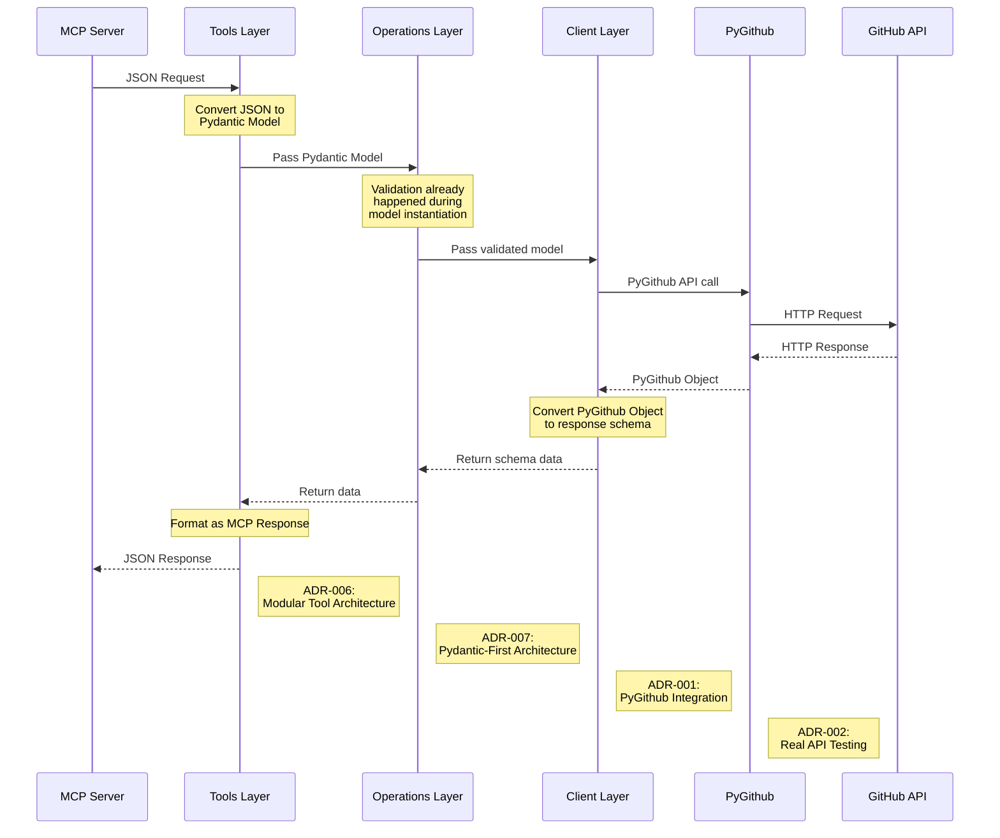
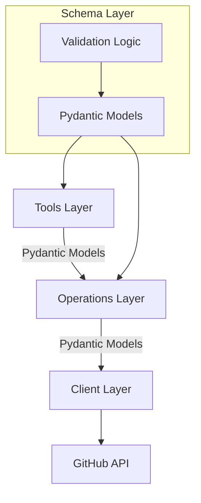
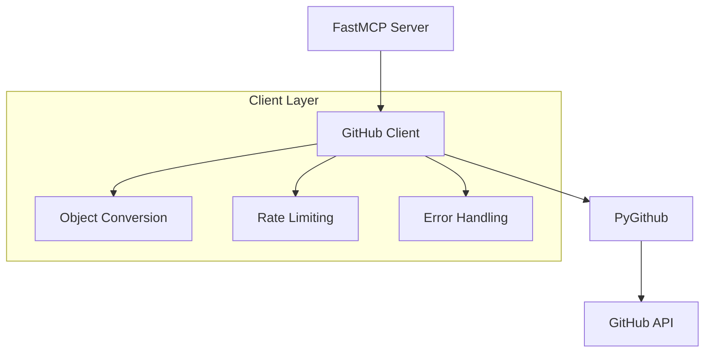
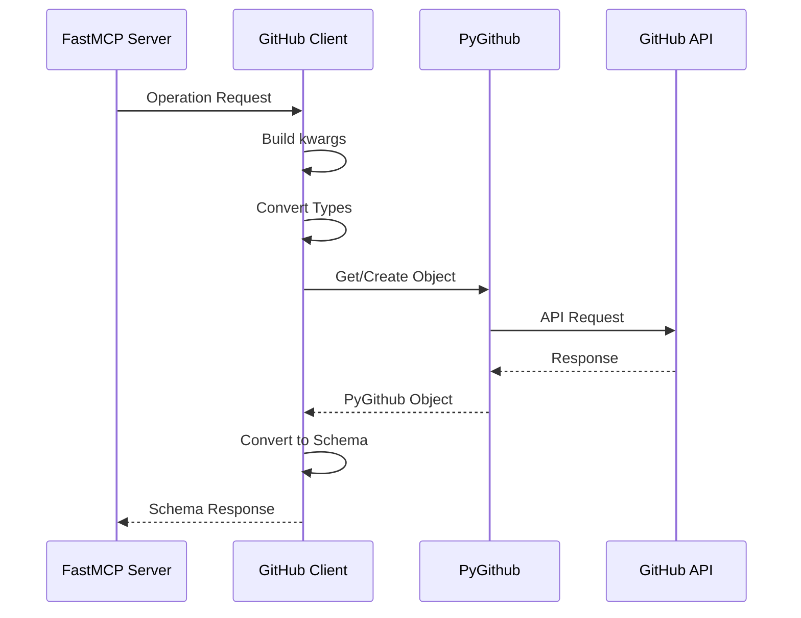
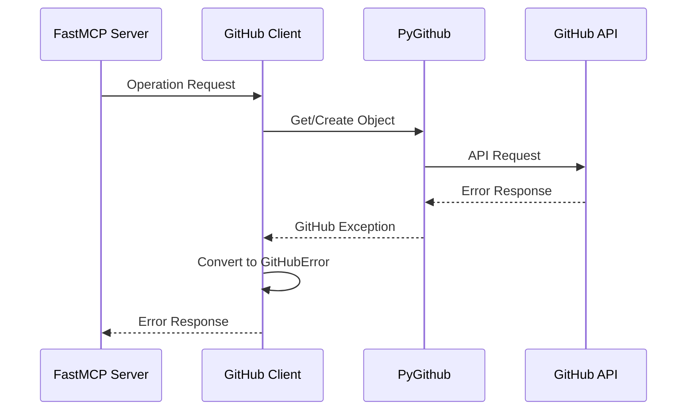

# System Patterns

> **Note:** This document provides detailed implementation patterns and best practices for the PyGithub MCP Server. For a high-level overview of the technology stack and architecture, please refer to [`tech_context.md`](tech_context.md).

## System Architecture Overview

This diagram provides a comprehensive view of how the various architectural decisions work together in the PyGithub MCP Server:

```mermaid
flowchart TD
    subgraph "MCP Server"
        direction TB
        
        subgraph "Tools Layer (ADR-006)"
            ToolReg["Tool Registration System"]
            IssueTools["Issue Tools"]
            RepoTools["Repository Tools"]
            PRTools["PR Tools"]
            Config["Configuration System"]
            
            ToolReg --> IssueTools
            ToolReg --> RepoTools
            ToolReg --> PRTools
            Config --> ToolReg
        end
        
        subgraph "Operations Layer"
            Issues["Issue Operations"]
            Repos["Repository Operations"]
            PRs["PR Operations"]
            
            IssueTools --> Issues
            RepoTools --> Repos
            PRTools --> PRs
        end
        
        subgraph "Client Layer (ADR-001)"
            Client["GitHub Client"]
            RateLimit["Rate Limit Handling"]
            
            Issues --> Client
            Repos --> Client
            PRs --> Client
            Client --> RateLimit
        end
        
        PyGithub["PyGithub Library"]
        Client --> PyGithub
    end
    
    GitHub["GitHub API"]
    PyGithub --> GitHub
    
    subgraph "Schema Layer (ADR-003, ADR-004)"
        direction TB
        BaseModels["Base Models"]
        IssueModels["Issue Models"]
        RepoModels["Repository Models"]
        PRModels["PR Models"]
        Validation["Field Validators"]
        
        BaseModels --- IssueModels
        BaseModels --- RepoModels
        BaseModels --- PRModels
        Validation -.- IssueModels
        Validation -.- RepoModels
        Validation -.- PRModels
    end
    
    IssueTools <-.-> IssueModels
    RepoTools <-.-> RepoModels
    PRTools <-.-> PRModels
    
    Issues <-.-> IssueModels
    Repos <-.-> RepoModels
    PRs <-.-> PRModels
    
    subgraph "Data Transformation (ADR-005)"
        direction TB
        IssueConv["Issue Converters"]
        RepoConv["Repository Converters"]
        UserConv["User Converters"]
        CommonConv["Common Converters"]
        
        IssueConv --> CommonConv
        RepoConv --> CommonConv
        UserConv --> CommonConv
    end
    
    Client --> IssueConv
    Client --> RepoConv
    Client --> UserConv
    
    subgraph "Testing (ADR-002)"
        direction TB
        UnitTests["Unit Tests"]
        IntegTests["Integration Tests"]
        TestData["Test Data Classes"]
        
        UnitTests --- TestData
        IntegTests --> GitHub
    end
    
    style IssueModels fill:#f9f,stroke:#333,stroke-width:2px
    style RepoModels fill:#f9f,stroke:#333,stroke-width:2px
    style PRModels fill:#f9f,stroke:#333,stroke-width:2px
    style BaseModels fill:#f9f,stroke:#333,stroke-width:2px
    
    style Client fill:#bbf,stroke:#333,stroke-width:2px
    style PyGithub fill:#bbf,stroke:#333,stroke-width:2px
    
    style Issues fill:#bfb,stroke:#333,stroke-width:2px
    style Repos fill:#bfb,stroke:#333,stroke-width:2px
    style PRs fill:#bfb,stroke:#333,stroke-width:2px
    
    style IssueTools fill:#fbb,stroke:#333,stroke-width:2px
    style RepoTools fill:#fbb,stroke:#333,stroke-width:2px
    style PRTools fill:#fbb,stroke:#333,stroke-width:2px
    style ToolReg fill:#fbb,stroke:#333,stroke-width:2px
    style Config fill:#fbb,stroke:#333,stroke-width:2px
```



### Request Flow (ADR-007: Pydantic-First Architecture)

This diagram shows the end-to-end flow of a request through the system, highlighting how the Pydantic-First Architecture works:



## Core Architecture

### Pydantic-First Architecture


### GitHub Integration


### Component Relationships

1. GitHub Client (Singleton)
   - Manages PyGithub instance
   - Handles authentication
   - Provides conversion utilities
   - Manages rate limiting
   - Centralizes error handling

2. Operation Modules
   - Use GitHub client for API interactions
   - Accept Pydantic models directly (ADR-007)
   - Maintain consistent patterns
   - Focus on specific domains
   - Handle pagination

3. Schema Layer
   - Models based on PyGithub objects
   - Organized by domain (ADR-003)
   - Enhanced validation (ADR-004)
   - Clear type definitions
   - Documented relationships

4. Tools Layer
   - Organized by domain (ADR-006)
   - Configuration-driven registration
   - Decorator-based tool system
   - Consistent error handling
   - Clean MCP protocol interface

## Best Practices

### 1. Pydantic Model Usage
- Define all input parameters as Pydantic models
- Let Pydantic handle validation at model instantiation
- Pass models directly between layers
- Define field validators for special validation needs
- Use strict=True to prevent unwanted type coercion

### 2. Tool Implementation
- Organize tools by domain (issues, repositories, etc.)
- Use the @tool() decorator for registration
- Register tools through the module's register function
- Consistent error handling across all tools
- Clear parameter validation through Pydantic models

### 3. Error Handling
- Use GitHubError for all client-facing errors
- Provide clear error messages with context
- Handle rate limits with exponential backoff
- Include resource information in error messages
- Consistent formatting across all error types

### 4. Testing
- Test with real API interactions when possible
- Use dataclasses instead of MagicMock for test objects
- Focus on testing behavior rather than implementation
- Implement proper cleanup for test resources
- Tag resources created during tests for identification

### 5. Configuration
- Use environment variables for deployment configuration
- Provide sensible defaults for all settings
- Clear precedence rules for configuration sources
- Document all configuration options
- Support selective tool group enabling/disabling

### 6. Optional Parameter Handling
- Only include parameters in kwargs when they have non-None values
- Convert primitive types to PyGithub objects before passing (e.g., milestone number → Milestone object)
- Handle object conversion errors explicitly
- Document parameter requirements in docstrings
- Test with various parameter combinations

## Implementation Patterns

### 1. Pydantic-First Operations
```python
# Pattern for operations layer with Pydantic-First architecture
from typing import List, Dict, Any
from ..schemas.issues import ListIssuesParams
from ..client import GitHubClient
from github import GithubException

def list_issues(params: ListIssuesParams) -> List[Dict[str, Any]]:
    """List issues in a repository.

    Args:
        params: Validated parameters for listing issues

    Returns:
        List of issues from GitHub API

    Raises:
        GitHubError: If the API request fails or validation fails
    """
    try:
        client = GitHubClient.get_instance()
        repository = client.get_repo(f"{params.owner}/{params.repo}")

        # Build kwargs from Pydantic model
        kwargs = {"state": params.state or 'open'}
        
        # Add optional parameters only if provided
        if params.sort:
            kwargs["sort"] = params.sort
        if params.direction:
            kwargs["direction"] = params.direction
        if params.since:
            kwargs["since"] = params.since
        
        # Get paginated issues and handle pagination
        paginated_issues = repository.get_issues(**kwargs)
        issues = get_paginated_items(paginated_issues, params.page, params.per_page)
        
        # Convert each issue to our schema
        return [convert_issue(issue) for issue in issues]
    except GithubException as e:
        raise client._handle_github_exception(e)
```

### 2. Pydantic-First Tools
```python
# Pattern for tools layer with Pydantic-First architecture
from ..schemas.issues import ListIssuesParams
from pygithub_mcp_server.tools import tool
from pygithub_mcp_server.operations import issues
from pygithub_mcp_server.errors import GitHubError, format_github_error

@tool()
def list_issues(params: ListIssuesParams) -> dict:
    """List issues from a GitHub repository.
    
    Args:
        params: Parameters for listing issues
    
    Returns:
        List of issues from GitHub API
    """
    try:
        # Pass the validated Pydantic model directly to operations
        result = issues.list_issues(params)
        return {"content": [{"type": "text", "text": json.dumps(result, indent=2)}]}
    except GitHubError as e:
        return {
            "content": [{"type": "error", "text": format_github_error(e)}],
            "is_error": True
        }
```

### 3. Tool Registration and Configuration
```python
# In tools/issues/__init__.py
def register(mcp):
    """Register all issue tools with the MCP server."""
    from pygithub_mcp_server.tools import register_tools
    from .tools import create_issue, list_issues, get_issue, update_issue
    
    register_tools(mcp, [
        create_issue,
        list_issues,
        get_issue,
        update_issue,
        # Other issue tools
    ])

# In server.py
from pygithub_mcp_server.config import load_config
from pygithub_mcp_server.tools import load_tools

def create_server():
    """Create and configure the MCP server."""
    # Create FastMCP server instance
    mcp = FastMCP(
        "pygithub-mcp-server",
        version=VERSION,
        description="GitHub API operations via MCP"
    )
    
    # Load configuration
    config = load_config()
    
    # Load and register tools based on configuration
    load_tools(mcp, config)
    
    return mcp
```

### 4. Validation Error Handling
```python
# Pattern for consistent validation error handling
import functools
from pydantic import ValidationError
from .github import GitHubError

def validation_error_to_github_error(func):
    """Decorator to convert Pydantic ValidationError to GitHubError."""
    @functools.wraps(func)
    def wrapper(*args, **kwargs):
        try:
            return func(*args, **kwargs)
        except ValidationError as e:
            errors = e.errors()
            if errors:
                field = errors[0].get('loc', ['unknown'])[0]
                message = errors[0].get('msg', 'Invalid value')
                error_msg = f"Validation error: {field} - {message}"
            else:
                error_msg = "Invalid input data"
                
            raise GitHubError(error_msg)
    return wrapper
```

### 5. Schema Conversion
```python
# Pattern for object conversion
def convert_issue(issue):
    """Convert a PyGithub Issue object to our schema format."""
    return {
        "number": issue.number,
        "title": issue.title,
        "body": issue.body,
        "state": issue.state,
        "created_at": issue.created_at.isoformat(),
        "updated_at": issue.updated_at.isoformat(),
        "user": {
            "login": issue.user.login,
            "id": issue.user.id,
            "url": issue.user.html_url
        },
        "labels": [{"name": label.name, "color": label.color} for label in issue.labels],
        "comments": issue.comments,
        "url": issue.html_url
    }
```

### 6. Error Handling
```python
# Pattern for error handling
try:
    github_obj = client.operation()
    return convert_github_object(github_obj)
except GithubException as e:
    raise GitHubError(str(e))
```

### 7. Pagination Handling
```python
# In converters/common/pagination.py
def get_paginated_items(paginated_list, page=None, per_page=None):
    """Get items from a PyGithub PaginatedList with pagination support.
    
    Args:
        paginated_list: PyGithub PaginatedList object
        page: Optional page number (1-based)
        per_page: Optional items per page
        
    Returns:
        List of items from the paginated list
    """
    if page is not None and per_page is not None:
        # Use both page and per_page for precise pagination
        start = (page - 1) * per_page
        end = start + per_page
        try:
            return list(paginated_list[start:end])
        except IndexError:
            # Handle case where start is beyond the list length
            return []
    elif page is not None:
        # Use default per_page value (30) with specified page
        try:
            return paginated_list.get_page(page - 1)
        except IndexError:
            return []
    elif per_page is not None:
        # Get just the first per_page items
        try:
            return list(paginated_list[:per_page])
        except IndexError:
            return []
    else:
        # No pagination, get all items (use with caution!)
        return list(paginated_list)
```

## System Flow

### Operation Flow


### Error Flow


## Design Patterns

### 1. Singleton Pattern (GitHub Client)
```python
class GitHubClient:
    _instance = None

    @classmethod
    def get_instance(cls):
        if cls._instance is None:
            cls._instance = cls()
        return cls._instance
```

### 2. Factory Pattern (Object Conversion)
```python
class GitHubObjectFactory:
    @staticmethod
    def create_from_github_object(obj):
        if isinstance(obj, github.Issue.Issue):
            return convert_issue(obj)
        elif isinstance(obj, github.Repository.Repository):
            return convert_repository(obj)
        elif isinstance(obj, github.PullRequest.PullRequest):
            return convert_pull_request(obj)
        # ... other object types
        else:
            raise ValueError(f"Unsupported GitHub object type: {type(obj)}")
```

### 3. Strategy Pattern (Error Handling)
```python
class ErrorHandler:
    def handle_error(self, error):
        if isinstance(error, RateLimitExceededException):
            return handle_rate_limit(error)
        elif isinstance(error, UnknownObjectException):
            return handle_not_found(error)
        elif isinstance(error, GithubException):
            if error.status == 403:
                return handle_permission_error(error)
            # ... other status codes
        return handle_unknown_error(error)
```

### 4. Decorator Pattern (Tool Registration)
```python
def tool():
    """Decorator to register a function as an MCP tool."""
    def decorator(func):
        func._is_tool = True
        return func
    return decorator
```

## Testing Patterns

### 1. Unit Testing with Dataclasses
```python
from dataclasses import dataclass

@dataclass
class RepositoryOwner:
    login: str
    id: int
    html_url: str

@dataclass
class Repository:
    id: int
    name: str
    full_name: str
    owner: RepositoryOwner
    private: bool
    html_url: str
    description: str = None

def test_convert_repository():
    # Given
    owner = RepositoryOwner(
        login="test-user",
        id=12345,
        html_url="https://github.com/test-user"
    )
    repo = Repository(
        id=98765,
        name="test-repo",
        full_name="test-user/test-repo",
        owner=owner,
        private=False,
        html_url="https://github.com/test-user/test-repo",
        description="Test repository"
    )
    
    # When
    result = convert_repository(repo)
    
    # Then
    assert result["id"] == 98765
    assert result["name"] == "test-repo"
    assert result["owner"]["login"] == "test-user"
```

### 2. Integration Testing with Real API
```python
@pytest.mark.integration
def test_create_issue_integration(test_owner, test_repo, test_cleanup):
    """Test creating an issue in a real GitHub repository."""
    # Generate a unique title to identify this test issue
    test_id = str(uuid.uuid4())[:8]
    title = f"Test Issue {test_id}"
    body = f"This is a test issue created by the integration test suite {test_id}."
    
    # Create parameters for the operation
    params = CreateIssueParams(
        owner=test_owner,
        repo=test_repo,
        title=title,
        body=body
    )
    
    # Call the operation directly
    result = issues.create_issue(params)
    
    # Add to cleanup for after-test removal
    test_cleanup.add_issue(test_owner, test_repo, result["number"])
    
    # Verify the response structure and content
    assert result["title"] == title
    assert result["body"] == body
    assert result["state"] == "open"
    assert "number" in result
```

### 3. Context Managers for Testing
```python
@contextmanager
def capture_stdout():
    """Capture stdout for testing."""
    new_stdout = StringIO()
    old_stdout = sys.stdout
    sys.stdout = new_stdout
    try:
        yield new_stdout
    finally:
        sys.stdout = old_stdout

def test_main_function():
    """Test main function output."""
    with capture_stdout() as stdout:
        main(["--version"])
        output = stdout.getvalue()
    
    assert "version" in output.lower()
```

## Documentation Patterns

### 1. Function Documentation
```python
def operation_name(params: ParamsType) -> ResultType:
    """Operation description.
    
    Args:
        params: Parameter description
        
    Returns:
        Description of return value
        
    Raises:
        GitHubError: Error conditions
    """
```

### 2. Class Documentation
```python
class ClassName:
    """Class description.
    
    Attributes:
        attr_name: Attribute description
        
    Methods:
        method_name: Method description
    """
```

### 3. Schema Documentation
```python
class SchemaModel(BaseModel):
    """Schema description.
    
    Maps to PyGithub ObjectType.
    See: [link to PyGithub docs]
    """
```

## Validation Patterns

### 1. Field Validation
```python
class SchemaModel(BaseModel):
    model_config = ConfigDict(strict=True)
    
    title: str = Field(..., description="Title field", strict=True)
    
    @field_validator('title')
    @classmethod
    def validate_title(cls, v):
        """Validate that title is not empty."""
        if not v.strip():
            raise ValueError("title cannot be empty")
        return v
```

### 2. Datetime Validation
```python
class DateTimeModel(BaseModel):
    since: Optional[datetime] = Field(
        None, 
        description="Filter by date (ISO 8601 format with timezone: YYYY-MM-DDThh:mm:ssZ)"
    )
    
    @field_validator('since', mode='before')
    @classmethod
    def validate_since(cls, v):
        """Convert string dates to datetime objects.
        
        Accepts:
        - ISO 8601 format strings with timezone (e.g., "2020-01-01T00:00:00Z")
        - ISO 8601 format strings with timezone without colon (e.g., "2020-01-01T12:30:45-0500")
        - datetime objects
        
        Returns:
        - datetime object
        
        Raises:
        - ValueError: If the string is not a valid ISO 8601 datetime with timezone
        """
        if isinstance(v, str):
            # Check for ISO format with time component and timezone
            if not ('T' in v and ('+' in v or 'Z' in v or '-' in v.split('T')[1])):
                raise ValueError(
                    f"Invalid ISO format datetime: {v}. "
                    f"Must be in format YYYY-MM-DDThh:mm:ss+00:00 or YYYY-MM-DDThh:mm:ssZ"
                )
            
            try:
                # Handle 'Z' timezone indicator by replacing with +00:00
                v = v.replace('Z', '+00:00')
                
                # Handle timezone formats without colons (e.g., -0500 -> -05:00)
                # Check if there's a timezone part (+ or - followed by 4 digits)
                if ('+' in v or '-' in v.split('T')[1]):
                    # Find the position of the timezone sign
                    sign_pos = max(v.rfind('+'), v.rfind('-'))
                    if sign_pos > 0:
                        timezone_part = v[sign_pos:]
                        # If timezone doesn't have a colon and has 5 chars (e.g., -0500)
                        if ':' not in timezone_part and len(timezone_part) == 5:
                            # Insert colon between hours and minutes
                            v = v[:sign_pos+3] + ':' + v[sign_pos+3:]
                
                return datetime.fromisoformat(v)
            except ValueError:
                raise ValueError(
                    f"Invalid ISO format datetime: {v}. "
                    f"Contains invalid date/time components."
                )
        return v
```

### 3. Enum Validation
```python
class StateModel(BaseModel):
    state: Optional[str] = Field(
        None, 
        description=f"Issue state: {', '.join(VALID_STATES)}"
    )
    
    @field_validator('state')
    @classmethod
    def validate_state(cls, v):
        """Validate that state is one of the allowed values."""
        if v is not None and v not in VALID_STATES:
            raise ValueError(f"Invalid state: {v}. Must be one of: {', '.join(VALID_STATES)}")
        return v
```

### 4. Numeric Validation
```python
class PaginationModel(BaseModel):
    page: Optional[int] = Field(
        None, 
        description="Page number for pagination (1-based)"
    )
    per_page: Optional[int] = Field(
        None, 
        description="Results per page (max 100)"
    )
    
    @field_validator('page')
    @classmethod
    def validate_page(cls, v):
        """Validate that page is a positive integer."""
        if v is not None and v < 1:
            raise ValueError("Page number must be a positive integer")
        return v
    
    @field_validator('per_page')
    @classmethod
    def validate_per_page(cls, v):
        """Validate that per_page is a positive integer <= 100."""
        if v is not None:
            if v < 1:
                raise ValueError("Results per page must be a positive integer")
            if v > 100:
                raise ValueError("Results per page cannot exceed 100")
        return v
```

## Schema Validation Testing

### 1. Basic Validation Testing
```python
def test_valid_data(valid_data):
    """Test that valid data passes validation."""
    params = SchemaModel(**valid_data)
    assert params.field == valid_data["field"]

def test_invalid_field_types(valid_base_data):
    """Test that invalid field types raise validation errors."""
    with pytest.raises(ValidationError) as exc_info:
        SchemaModel(
            **valid_base_data,
            field=123  # Should be a string
        )
    assert "field" in str(exc_info.value).lower()

def test_empty_string_validation(valid_base_data):
    """Test that empty strings raise validation errors."""
    with pytest.raises(ValidationError) as exc_info:
        SchemaModel(
            **valid_base_data,
            field=""
        )
    assert "field cannot be empty" in str(exc_info.value).lower()
```

### 2. Datetime Testing
```python
def test_datetime_parsing(valid_base_data):
    """Test that datetime strings are correctly parsed."""
    # Test with various formats
    params = DateTimeModel(
        **valid_base_data,
        since="2020-01-01T00:00:00Z"
    )
    assert isinstance(params.since, datetime)
    
    # Test with negative timezone offset
    params = DateTimeModel(
        **valid_base_data,
        since="2020-01-01T12:30:45-05:00"
    )
    assert isinstance(params.since, datetime)
    
    # Test with compact negative timezone offset
    params = DateTimeModel(
        **valid_base_data,
        since="2020-01-01T12:30:45-0500"
    )
    assert isinstance(params.since, datetime)
    
    # Test with timezone format that has a colon (no normalization needed)
    params = DateTimeModel(
        **valid_base_data,
        since="2020-01-01T12:30:45+05:00"
    )
    assert isinstance(params.since, datetime)
    
    # Test with timezone format that doesn't have 5 chars (e.g., +05)
    params = DateTimeModel(
        **valid_base_data,
        since="2020-01-01T12:30:45+05"
    )
    assert isinstance(params.since, datetime)

def test_invalid_datetime_format(valid_base_data):
    """Test behavior with invalid datetime format."""
    with pytest.raises(ValidationError) as exc_info:
        DateTimeModel(
            **valid_base_data,
            since="2020-01-01"  # Missing time component
        )
    assert "Invalid ISO format datetime" in str(exc_info.value)
```
